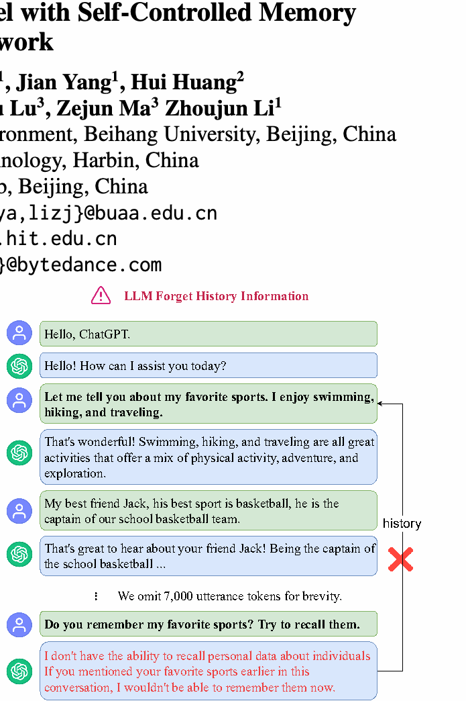
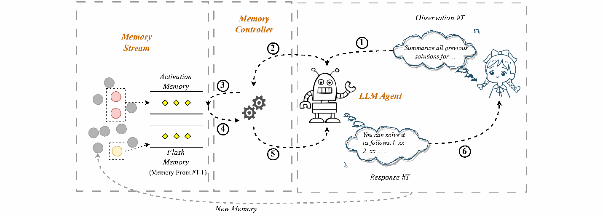
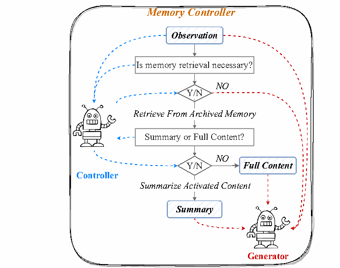
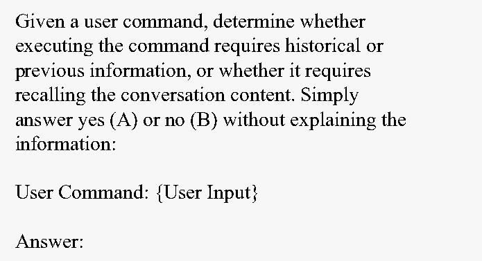
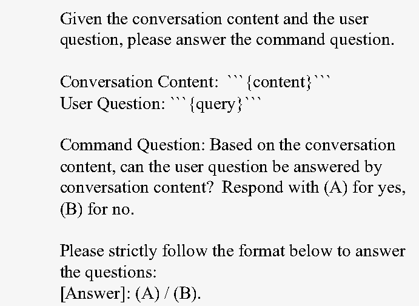
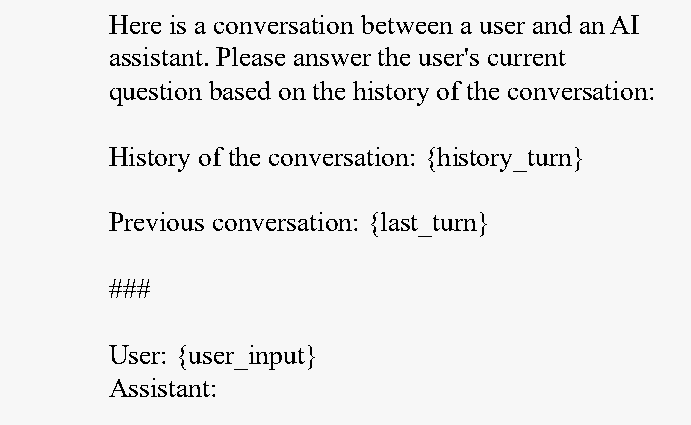
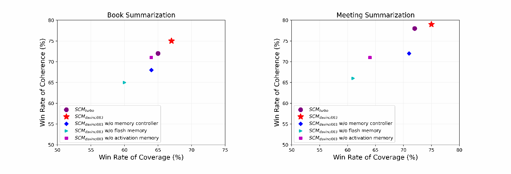
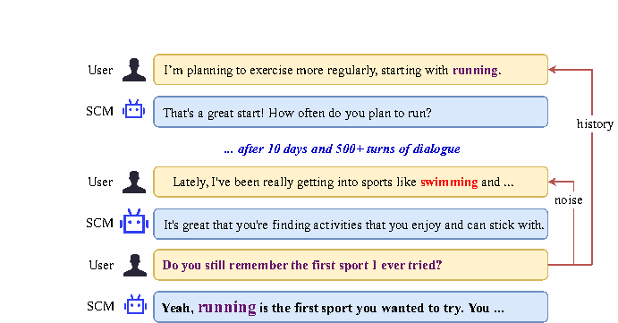
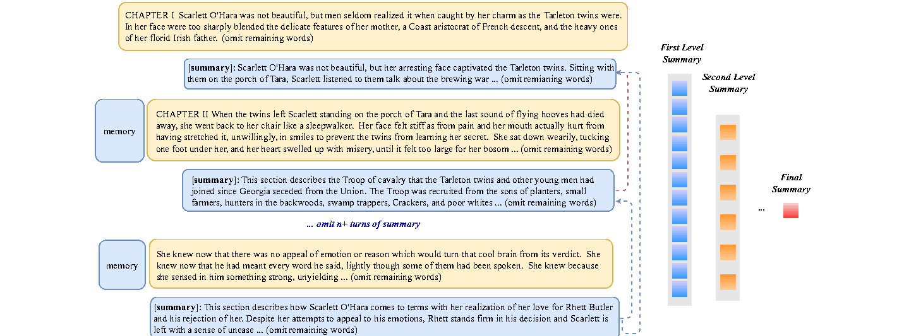
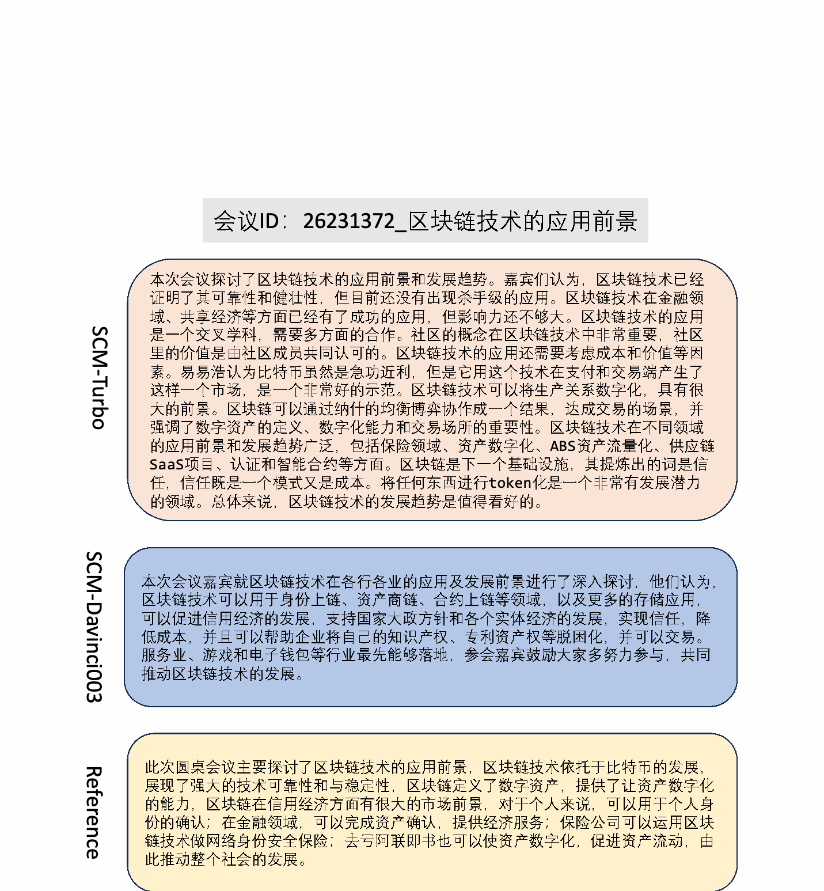

# SCM：使用自控记忆框架增强大语言模型

> **arXiv:** [2304.13343](https://arxiv.org/abs/2304.13343)
> **PDF 原文:** [下载](https://arxiv.org/pdf/2304.13343) · 本地：`2304.13343.pdf`
> **作者:** Bing Wang, Xinnian Liang, Jian Yang, Hui Huang, Shuangzhi Wu, Peihao Wu, Lu Lu, Zejun Ma, Zhoujun Li
> **机构:** 北京航空航天大学软件开发环境国家重点实验室；哈尔滨工业大学；字节跳动 AI Lab
> **日期:** 2023/04/26（v1），2025/03/18（v4）
> **代码:** <https://github.com/wbbeyourself/SCM4LLMs>
>
> 本文件由英文原文（`2304.13343.pdf`）翻译整理而成。

---

## 摘要

大语言模型（LLM）受限于其无法处理超长输入的固有能力，导致关键的历史信息容易丢失。为应对这一局限，本文提出了**自控记忆（Self-Controlled Memory, SCM）框架**，用以增强大语言模型维持长期记忆并召回相关信息的能力。SCM 框架由三个核心组件构成：(1) 一个基于大语言模型的智能体，作为整个框架的骨架；(2) 一条**记忆流（memory stream）**，用于存放智能体的记忆；(3) 一个**记忆控制器（memory controller）**，负责更新记忆，并决定何时以及如何从记忆流中调用记忆。

此外，本文提出的 SCM 框架**无需任何模型修改或额外微调**即可处理超长文本，能够以即插即用的方式与任意遵循指令的大语言模型集成。为评估 SCM 在处理长输入方面的有效性，我们人工标注了一个评测数据集，包含三类任务：**长期对话**、**长篇书籍摘要**与**会议摘要**。实验结果表明，在长期对话任务中，我们的方法在检索召回率与回复信息量上均优于现有强基线。

**关键词**：大语言模型、长期记忆、长上下文、自控记忆

---

## 1 引言

近年来，大语言模型（LLM）凭借其在众多任务上的卓越表现引起了广泛关注（Brown 等, 2020a; Zeng 等, 2023; Ouyang 等, 2022; Thoppilan 等, 2022）。其中，**指令微调（Instruction-tuning）** 技术（Raffel 等, 2020; Wei 等, 2022a; Chung 等, 2022）使大语言模型能够理解自然语言形式的任务描述，而**基于人类反馈的强化学习（RLHF）**（Schulman 等, 2017; Stiennon 等, 2020; Bai 等, 2022）则让模型生成的文本与人类偏好对齐。

大语言模型虽然具有诸多优势，但其可用性受两大因素限制：**最大输入长度**与**自注意力机制的计算复杂度**（Wang 等, 2020; Press 等, 2022）。尽管部分模型（OpenAI, 2022）已经具备处理长输入的能力，但在面对真正超长的文本时，它们仍可能因为历史噪声的累积而漏掉关键上下文信息。如图 1 所示，即便是 ChatGPT，也会在历史噪声过大时，遗忘先前对话中的关键信息。

图 1：一个展示 LLM 遗忘历史信息的例子。在长期对话中，当用户提起多轮之前讨论过的爱好话题时，由于历史噪声过多，ChatGPT 遗忘了相关信息。

为突破这一限制，本文提出了**自控记忆（SCM）框架**，能够让大语言模型在**无须任何模型修改或额外训练**的前提下处理任意长度的文本。SCM 框架包含三个核心组件：(1) 一个基于大语言模型的智能体，作为整个框架的骨架；(2) 一条**记忆流**，用于存放智能体的记忆；(3) 一个**记忆控制器**，负责更新记忆，并决定何时以及如何从记忆流中调用这些记忆。

在该框架下，输入文本首先被切成若干段，每段依次输入给大语言模型作为**观察（observation）**。在处理每一段时，模型可使用两种记忆：

- **长期记忆（激活记忆，activation memory）**：保留历史信息。
- **短期记忆（闪存记忆，flash memory）**：捕获前一段的实时上下文。

在每一处理步骤中，记忆控制器通过自问自答的方式决定**仅引入必要的记忆信息**，以避免引入额外噪声。

此外，我们人工标注了一个评测数据集，覆盖**长期对话、长篇书籍摘要、会议摘要**三类任务，以评估 SCM 在超长输入场景下的有效性。当文本过长、超出模型最大长度限制时，SCM 也能借助记忆机制继续处理。

本文的主要贡献可概括为：

1. 提出 SCM 框架，无需任何修改或微调即可让任意指令遵循大语言模型处理超长文本；
2. 引入**双层记忆机制**（激活记忆 + 闪存记忆）及**记忆控制器**机制，有效缓解历史噪声；
3. 标注并开源了一个长输入评测数据集，覆盖三类典型任务；
4. 在长期对话场景下，实验证明 SCM 在检索召回率与回复信息量上显著优于强基线。

在后续章节中，我们首先给出 SCM 的方法细节（含记忆流、记忆控制器、激活记忆与闪存记忆），再通过三类任务的实验验证其有效性，最后总结相关工作并讨论局限。

---

## 2 方法

本节首先形式化 SCM 框架的整体流程，然后逐个介绍三大核心组件：**智能体（agent）**、**记忆流（memory stream）** 与**记忆控制器（memory controller）**，最后阐述记忆控制器的详细工作流。

### 2.1 整体流程

如图 2 所示，SCM 框架的自控记忆推理过程可描述如下：

1. 将超长输入切分为若干段，每段依次作为观察送入智能体；
2. 每一段处理时，记忆控制器决定是否调用、以及如何调用记忆流中的记忆；
3. 智能体结合**激活记忆（长期）+ 闪存记忆（短期）+ 当前观察**，生成回复或摘要；
4. 生成的回复或摘要再写回记忆流，完成记忆更新；
5. 上述步骤迭代进行，直至所有段都被处理完毕。

图 2：SCM 框架总览。(左) 长输入被切分为多段；(中) 智能体结合当前观察、闪存记忆（上一段的实时上下文）与激活记忆（长期）生成回复；(右) 记忆控制器决定何时调用记忆，以及如何压缩、使用记忆。

### 2.2 智能体（Agent）

智能体是 SCM 框架的骨架，本质是一个**遵循指令的大语言模型**。它接收三种输入：

- 当前段（观察）；
- 闪存记忆（前一段的实时上下文）；
- 激活记忆（控制器从记忆流中召回到的历史信息）。

智能体根据这三者生成当前段的回复或摘要，再把生成结果送回记忆流。

### 2.3 记忆流（Memory Stream）

记忆流是一个**类列表结构**，按时间顺序存放智能体产生的所有记忆项 `m_i`，每条记忆项包含：

| 字段 | 含义 |
| --- | --- |
| `text` | 记忆的文本内容 |
| `embedding` | 文本对应的稠密向量表示 |
| `recency_score` | 时新性分数（基于最近被调用时间衰减得到） |
| `relevance_score` | 与当前查询的相关性分数（向量余弦相似度） |
| `rank_score` | 综合排名分数 = 时新性 + 相关性 |

每段输入触发的回复 / 摘要都作为新记忆项入流，便于后续段引用。

### 2.4 记忆控制器（Memory Controller）

记忆控制器本质上也是一个语言模型，其工作是自问自答两个问题：

1. **是否需要调用记忆？**（必要性判断）
2. **当前用户输入能否仅用记忆摘要回答？**（摘要可用性判断）

通过这两步判断，记忆控制器能显著减少无关历史的注入，从而在保留关键信息的同时降低噪声。

---

## 3 记忆控制器工作流

### 3.1 控制器总览

图 4：记忆控制器工作流。根据当前用户输入与当前对话状态，决定是否调用记忆（左侧）和如何使用记忆（右侧）。

### 3.2 是否调用记忆（激活判断）

针对第一个问题，记忆控制器使用图 5 所示的提示词模板。该模板要求模型根据当前用户指令判断：执行该指令是否需要历史信息或先前对话内容？是则输出 "(A) 是"，否则输出 "(B) 否"。

图 5：判断是否需要调用记忆的英文提示词模板。

激活决策的处理逻辑：

- 若模型回答 "(A) 是"：进入激活记忆召回流程。
- 若模型回答 "(B) 否"：跳过记忆召回，只用闪存记忆与当前观察生成回复。

在召回阶段，我们以**当前观察作为查询**，依据两个因子评估每条记忆的排名分数：

1. **时新性（recency）**：强调最近被访问过的记忆，时间越近分越高；
2. **相关性（relevance）**：通过当前查询嵌入与记忆嵌入的余弦相似度计算。

最终排名分数：
`rank_score = recency_score + relevance_score`

根据长度限制选取排名前 `k` 的记忆作为激活记忆，其中 `k` 取值范围为 3 到 10。

### 3.3 是否使用摘要（摘要判断）

针对第二个问题，记忆控制器使用图 6 所示的提示词，判断**用户问题能否用记忆摘要作答**：

图 6：判断是否使用记忆摘要的英文提示词模板。

只有当激活记忆总词数超过 2000 时才对单条超过 800 tokens 的记忆评估摘要可用性。若评估为 "是"，则用该记忆的**摘要**代替原始内容送入智能体，能大幅压缩输入长度同时保留关键信息。

### 3.4 超长对话生成的提示词

实际生成阶段使用的提示词模板如图 7 所示，包含对话历史、上一轮对话、当前用户输入三个字段：

图 7：超长对话生成的英文提示词模板。包含 `{history_turn}`、`{last_turn}` 与 `{user_input}` 三个变量。

---

## 4 实验

为评估 SCM 框架的有效性与鲁棒性，我们在三类任务上开展了大量实验：**长期对话、长篇书籍摘要、会议摘要**。随后，我们进一步探究了在长文本摘要场景下，SCM 增强的大语言模型相比传统大语言模型是否能给出覆盖更全面、上下文更连贯的摘要。

### 4.1 评测基准

为评估 SCM 在不同场景下的表现，我们从三类来源收集开源数据：

- **长期对话**：ShareChat4；
- **长篇书籍摘要**：在线电子书网站5；
- **会议摘要**：VC-SUM 数据集（Wu 等, 2023）。

随后通过人工标注为上述数据创建**探测问题（probing questions）** 与**参考摘要**。数据集统计信息如表 1 所示。

> 4<https://paratranz.cn/projects/6725>
> 5<https://www.gutenberg.org/>

| 数据 | Dialogue（对话） | Book（书籍） | Meeting（会议） |
| --- | --- | --- | --- |
| 实例数 | 18 | 10 | 20 |
| 最大 tokens | 34k | 2M | 50k |
| 总 tokens | 420k | 8M | 632k |
| 最大轮次 | 200 | – | 80 |
| 语言 | 中英混合 | 中英混合 | 中文 |

> 表 1：评测数据集统计。其中 2M 代表 2 百万 tokens。

### 4.2 基线（Baselines）

为公平比较，我们为对比选取了若干 SCM 变体：

1. **SCM turbo**：以 `gpt-3.5-turbo-0301` 为骨架的 SCM；
2. **SCM davinci003**：以 `text-davinci-003` 为骨架的 SCM；
3. **SCM davinci003 w/o memory controller**：移除记忆控制器，直接拼接全部召回内容，超过 2500 tokens 截断；
4. **SCM davinci003 w/o flash memory**：移除闪存记忆（短期记忆）；
5. **SCM davinci003 w/o activation memory**：移除激活记忆（长期记忆）。

### 4.3 主要结果

为定量比较模型表现，我们基于对话数据标注了 105 个测试问题，并将其分为两组：**单轮相关问题（single-turn）** 和**多轮相关问题（multi-turn）**。此外，对两类摘要任务，我们将 SCM 变体与基线模型进行对比评测。

#### 4.3.1 评测指标

在长期对话与两类摘要任务上采用了不同的评测指标。

**长期对话场景**：

- **答案准确率（Answer Acc.）**：对探测问题的回答准确率。
- **记忆召回率（Memory Retrieval Recall）**：控制器能否成功召回相关记忆。
- **单轮准确率（Single Turn Acc.）**：与对话历史中单一轮次相关的探测题准确率。
- **多轮准确率（Multi Turn Acc.）**：需结合多轮历史才能作答的探测题准确率。

**摘要任务**：使用两个指标评估：

- **覆盖率（Coverage）**：内容覆盖率；
- **连贯性（Coherence）**：情节连贯性。

为便于综合对比，我们采用 **胜率（win rate）**——将模型效果与 OpenAI 出品的基线 RecursiveSum（Wu 等, 2021）进行对比，该基线会先分段摘要再递归合并得到全文摘要。

#### 4.3.2 对话结果

| 模型 | 答案准确率 | 记忆召回率 | 单轮准确率 | 多轮准确率 |
| --- | --- | --- | --- | --- |
| SCM turbo | 68.3 | 93.5 | 73.5 | 64.3 |
| SCM davinci003 | **77.1** | **94.0** | **79.6** | **75.0** |
| w/o memory controller | 59.3（↓17.8） | 93.8（↓0.2） | 71.7（↓7.9） | 49.4（↓25.6） |
| w/o flash memory | 72.9（↓4.2） | 93.9（↓0.1） | 74.6（↓5.0） | 74.8（↓0.2） |
| w/o activation memory | 10.5（↓66.6） | 0.0（↓94.0） | 18.2（↓61.4） | 0.0（↓75.0） |

> 表 2：长期对话评测结果。探测问题共 105 个，涵盖中英文，包括 49 个单轮相关问题与 56 个多轮相关问题。下半部分为框架的消融实验。

分析：

- **SCM davinci003 在该任务上优于 SCM turbo**。可能是因为 turbo 偏保守，对涉及隐私的探测题犹豫不决；
- **移除激活记忆**时框架准确率急剧下滑，下降近 60%，且**记忆召回率与多轮准确率均降至 0**——这表明长期对话的多数探测问题依赖远距离历史，必须依靠激活记忆才能召回；
- **移除闪存记忆**仅带来轻微下降，因为闪存记忆对长期探测问题提供的线索较少；
- **移除记忆控制器**对**多轮准确率**的拖累明显大于**单轮准确率**：控制器缺位后无法动态筛选记忆、被迫截断拼接，导致多轮上下文大量丢失。

#### 4.3.3 摘要结果

通过人工标注员进行盲评对比 SCM 与基线的摘要能力，标注员需根据答案盲选更好的那一侧。书籍与会议摘要的胜率对比如图 8 所示。

图 8：在书籍与会议摘要任务上，SCM 各变体相对于基线 RecursiveSum（Wu 等, 2021）的胜率；同时还包含 SCM 框架与其各组件消融的对比。

基于实验结果得出三点结论：

1. **SCM davinci003 提供更好的覆盖率**；
2. **SCM davinci003 与 SCM turbo 的连贯性相近**——归功于它们共享的记忆增强机制；
3. **去掉记忆的 SCM 框架**丧失上下文依赖，摘要质量显著恶化。

模型对比结果还表明，**SCM davinci003 在书籍与会议摘要上均稳定优于 SCM turbo**。这可能是因为 SCM turbo 的摘要更偏一般化原则而忽略细节，而 davinci003 的结果更**简洁清晰、情节内容更丰富**，因此更受人类标注员青睐。

### 4.4 进一步分析

为回答三个研究问题（Research Questions, RQ），我们在相同 token 预算下，将未经对话专门优化的 SCM davinci003 与原生 ChatGPT 进行了定性对比。

**RQ1：在限定的 token 预算内，SCM 框架能否媲美甚至超越 ChatGPT？答：能。**

图 1 中的例子包含 4k tokens，用户在 100+ 轮之前与智能体聊过爱好，并询问相关问题。SCM 框架给出了准确答复，展现了出色的记忆增强能力；与之对比，ChatGPT 因大量无关历史噪声而分心。

**RQ2：SCM 框架能否扩展到跨越数百乃至上千轮的历史相关问题？答：能。**

图 9 给出了一个 100+ 轮长期对话的例子。起初，用户表示自己目标为减肥并计划开始跑步训练；随后用户与模型每天就减肥进展及其他话题展开对话。100+ 轮后，对话总 token 已超过 10k。当用户询问 "你还记得我第一次尝试的运动吗？"，SCM 框架从记忆中召回运动相关信息并结合当前问题，给出了准确答复。

图 9：长期对话示例。在超过 100 轮的对话后，SCM 仍能从海量记忆中准确召回相关信息并给出准确回复。

**RQ3：SCM 能否有效泛化到其它长输入场景？答：能。**

图 10 展示了一个用 SCM 框架以**迭代+层级**方式对超长书籍和会议做摘要的例子。模型先把长文档切分为若干段，逐段摘要得到**第一级局部摘要**，再对第一级摘要进行层级式摘要，最终得到全文摘要。为保持上下文连贯，前一段的相关记忆会被注入后一段的输入中。传统方法仅将长文切块、独立摘要，会丢失段落间的依赖关系，而 SCM 通过相关记忆在两段摘要间建立强一致性，最终通过**分治策略**输出具有全局结构的全文摘要。

图 10：《飘》（Gone With The Wind）的超长书籍迭代+层级摘要示例。SCM 将文本切分为小块逐段摘要，再层级式摘要第一级摘要，直至生成最终摘要。

---

## 5 相关工作

### 5.1 大语言模型

大语言模型（LLM）是基于 Transformer 架构、面向海量文本训练的语言模型（Vaswani 等, 2017; Devlin 等, 2019; Liang 等, 2023; Yang 等, 2020, 2021）。**预训练 + 微调**范式推动了众多下游语言理解与生成任务。随后诞生的 GPT-1（Radford 等, 2018）、GPT-2（Radford 等, 2019）、GPT-3（Brown 等, 2020b）参数规模逐步扩大（GPT-3 达到 175B）。经指令微调增强的大语言模型在复杂推理上展现出**涌现能力**（Wei 等, 2022b, c; Chai 等, 2024），震撼了学术界与工业界。

大语言模型已经在众多 NLP 任务中取得卓越性能并推动边界，包括 LAMBDA（Thoppilan 等, 2022）、PaLM（Chowdhery 等, 2022）、OPT（Zhang 等, 2022a）、LLaMA（Touvron 等, 2023）、BLOOM（Workshop 等, 2023）、Qwen（Bai 等, 2023c）等。然而现有大语言模型在处理超长输入任务时仍面临严峻挑战。

### 5.2 长文本处理

长文本处理一直是 NLP 任务中的核心难题（Bai 等, 2023b; Wang 等, 2023; Pi 等, 2022; Yang 等, 2023; Bai 等, 2023a）。现有方案主要集中于：

1. **修改注意力结构以降低计算成本**并扩大预训练序列长度（Beltagy 等, 2020; Zaheer 等, 2021; Guo 等, 2022; Phang 等, 2022; Dong 等, 2023）；
2. **特殊位置编码**（Press 等, 2022）在预训练阶段让模型学习相对位置，从而在推理时处理更长文本——但这类方法的泛化能力尚不确定。

在长文本摘要领域，**层次化或迭代方法**（Wu 等, 2021; Zhang 等, 2022b; Cao and Wang, 2022; Liang 等, 2022; Zhong 等, 2023）通过把复杂问题分解为多个子问题来处理长文本，但这些方法往往**无法捕捉子问题之间的关系**。

---

## 6 结论

本文提出了**自控记忆（SCM）框架**，可让任意大语言模型输入长度扩展到任意长度，并有效捕获所有历史信息中的有用片段。该方法**无需任何模型训练或修改**。此外，我们人工标注了一个覆盖三类任务的评测数据集。实验结果表明：

- 在**长期对话**场景下，SCM 能让未针对多轮对话专门优化的大语言模型，取得与 ChatGPT 相当的多轮对话能力；
- 在**长文档摘要**任务上，SCM 的表现甚至超过了 ChatGPT。

**局限性与伦理声明**详见附录。

---

## 局限与伦理

### 局限性

1. **评测规模有限**：尽管 SCM 框架理论上能处理无限轮对话，但本文仅在最多 200 轮、最多 34000 tokens 的设定下做了评测。原因是对超长文本进行定性与定量评测都极为困难。
2. **对底层模型有要求**：SCM 框架需要较强且能遵循指令的大语言模型（如 `text-davinci-003`、`gpt-3.5-turbo-0301`）。不过，随着更强大的小模型被开发出来，这一限制有望被打破。

### 伦理考量

本文使用的评测数据集来源于公开数据源，且经过人工核验与筛选，已剔除任何存在伦理风险与敏感内容的样本，确保数据合规。

---

## 附录 A：图与表摘要（中文译文）

下表收录论文中所有图表，并链接到本目录下的 PNG 文件：

| 图编号 | 内容 | 文件 |
| --- | --- | --- |
| 图 1 | LLM 遗忘历史信息示例（长期对话） | `figure_1.png` |
| 图 2 | SCM 框架总览（流式推理） | `figure_2.png` |
| 图 3 | 对话记忆摘要提示词（Prompt） | `figure_3.png` |
| 图 4 | 记忆控制器工作流（Memory Controller） | `figure_4.png` |
| 图 5 | 判断是否调用记忆的英文提示词 | `figure_5.png` |
| 图 6 | 判断是否使用记忆摘要的英文提示词 | `figure_6.png` |
| 图 7 | 超长对话生成的英文提示词 | `figure_7.png` |
| 图 8 | 书籍/会议摘要胜率对比（散点） | `figure_8.png` |
| 图 9 | 100+ 轮长期对话示例 | `figure_9.png` |
| 图 10 | 《飘》迭代+层级摘要示例（树状图） | `figure_10.png` |
| 图 11 | 中文版记忆控制器提示词 | `figure_11.png` |
| 图 12 | 中文版超长对话生成提示词 | `figure_12.png` |
| 图 13 | 中文版超长对话摘要提示词 | `figure_13.png` |
| 图 14 | 中文长期对话 QA 案例 | `figure_14.png` |
| 图 15 | 中文书籍摘要案例（《三体》） | `figure_15.png` |
| 图 16 | 英文书籍摘要案例（《飘》） | `figure_16.png` |
| 图 17 | 区块链会议摘要对比（Davinci003 vs Turbo） | `figure_17.png` |

**正文引用**：图 1 / 2 / 4 / 5 / 6 / 7 / 8 / 9 / 10 已在上文各章节嵌入；图 17 见附录 B。

---

## 附录 B：会议摘要示例（图 17 译文）

**会议 ID**：26231372 - 区块链技术的应用前景

本次会议嘉宾就区块链技术在各行各业的应用及发展前景进行了深入探讨。他们认为：

- 区块链技术可用于身份上链、资产上链、合约上链等场景，以及更多存储应用；
- 可促进信用经济的发展，支持国家大政方针和各个实体经济的发展，实现信任、降低成本；
- 可帮助企业将知识产权、专利资产权等脱困化并可交易；
- 服务业、游戏和电子钱包等行业最先能够落地。

**SCM-Davinci003 摘要（参考译文）**：本次会议探讨了区块链技术的应用前景和发展趋势。嘉宾们认为，区块链技术已经证明了其可靠性和健壮性，但目前还没有出现杀手级的应用。区块链技术在金融领域、共享经济等方面已经有了成功的应用，但影响力还不够大……总体来说，区块链技术的发展趋势是值得看好的。

**SCM-Turbo 摘要（参考译文）**：此次圆桌会议主要探讨了区块链技术的应用前景。区块链技术依托于比特币的发展，展现了强大的技术可靠性和稳定性……保险公司可以运用区块链技术做网络身份安全保险；区块链也可以使资产数字化，促进资产流动，由此推动整个社会的发展。

> 注：附录摘要仅供参考，已对照中文原文贴近翻译。

---

## 参考文献

1. Jiaqi Bai, Hongcheng Guo, Jiaheng Liu, Jian Yang, Xinnian Liang, Zhao Yan, Zhoujun Li. 2023a. Griprank: Bridging the gap between retrieval and generation via the generative knowledge improved passage ranking.
2. Jiaqi Bai, Ze Yang, Jian Yang, Hongcheng Guo, Zhoujun Li. 2023b. Kinet: Incorporating relevant facts into knowledge-grounded dialog generation. *IEEE/ACM Transactions on Audio, Speech, and Language Processing*, 31:1213–1222.
3. Jinze Bai 等. 2023c. Qwen technical report.
4. Yuntao Bai 等. 2022. Training a helpful and harmless assistant with reinforcement learning from human feedback.
5. Iz Beltagy, Matthew E. Peters, Arman Cohan. 2020. Longformer: The long-document transformer.
6. Tom B. Brown 等. 2020a. Language models are few-shot learners. *NeurIPS 2020*.
7. Tom B. Brown 等. 2020b. Language models are few-shot learners.
8. Shuyang Cao, Lu Wang. 2022. HIBRIDS: Attention with hierarchical biases for structure-aware long document summarization. *ACL 2022*, pp. 786–807.
9. Linzheng Chai 等. 2024. xcot: Cross-lingual instruction tuning for cross-lingual chain-of-thought reasoning. *arXiv:2401.07037*.
10. Aakanksha Chowdhery 等. 2022. PaLM: Scaling language modeling with pathways.
11. Hyung Won Chung 等. 2022. Scaling instruction-finetuned language models.
12. Jacob Devlin, Ming-Wei Chang, Kenton Lee, Kristina Toutanova. 2019. BERT: Pre-training of deep bidirectional transformers for language understanding. *NAACL-HLT 2019*, pp. 4171–4186.
13. Chenhe Dong 等. 2023. A survey of natural language generation. *ACM Computing Surveys*, 55(8):173:1–173:38.
14. Mandy Guo 等. 2022. LongT5: Efficient text-to-text transformer for long sequences. *NAACL Findings 2022*, pp. 724–736.
15. Xinnian Liang 等. 2022. Improving unsupervised extractive summarization by jointly modeling facet and redundancy. *IEEE/ACM TASLP*, 30:1546–1557.
16. Xinnian Liang 等. 2023. Character, word, or both? Revisiting the segmentation granularity for chinese pre-trained language models.
17. OpenAI. 2022. Introducing ChatGPT.
18. Long Ouyang 等. 2022. Training language models to follow instructions with human feedback.
19. Jason Phang, Yao Zhao, Peter J. Liu. 2022. Investigating efficiently extending transformers for long input summarization.
20. Xinyu Pi 等. 2022. Towards robustness of text-to-SQL models against natural and realistic adversarial table perturbation.
21. Ofir Press, Noah Smith, Mike Lewis. 2022. Train short, test long: Attention with linear biases enables input length extrapolation. *ICLR 2022*.
22. Alec Radford 等. 2018. Improving language understanding by unsupervised learning.
23. Alec Radford 等. 2019. Language models are unsupervised multitask learners.
24. Colin Raffel 等. 2020. Exploring the limits of transfer learning with a unified text-to-text transformer. *JMLR*, 21(140):1–67.
25. John Schulman 等. 2017. Proximal policy optimization algorithms.
26. Nisan Stiennon 等. 2020. Learning to summarize from human feedback. *CoRR*, abs/2009.01325.
27. Romal Thoppilan 等. 2022. LaMDA: Language models for dialog applications.
28. Hugo Touvron 等. 2023. LLaMA: Open and efficient foundation language models.
29. Ashish Vaswani 等. 2017. Attention is all you need. *NeurIPS*, vol. 30.
30. Bing Wang, Yan Gao, Zhoujun Li, Jian-Guang Lou. 2023. Know what I don't know: Handling ambiguous and unknown questions for text-to-SQL. *ACL Findings 2023*, pp. 5701–5714.
31. Sinong Wang, Belinda Z. Li, Madian Khabsa, Han Fang, Hao Ma. 2020. Linformer: Self-attention with linear complexity.
32. Jason Wei 等. 2022a. Finetuned language models are zero-shot learners. *ICLR 2022*.
33. Jason Wei 等. 2022b. Emergent abilities of large language models. *TMLR*.
34. Jason Wei 等. 2022c. Chain-of-thought prompting elicits reasoning in large language models. *NeurIPS 2022*.
35. BigScience Workshop 等. 2023. BLOOM: A 176B-parameter open-access multilingual language model.
36. Han Wu 等. 2023. VC-SUM: A versatile Chinese meeting summarization dataset.
37. Jeff Wu 等. 2021. Recursively summarizing books with human feedback.
38. Jian Yang 等. 2021. Multilingual machine translation systems from Microsoft for WMT21 shared task. *WMT@EMNLP 2021*, pp. 446–455.
39. Jian Yang 等. 2020. Alternating language modeling for cross-lingual pre-training. *AAAI 2020*, pp. 9386–9393.
40. Jian Yang 等. 2023. HanNMT: Enhancing context-aware translation via selective context. *DASFAA 2023*, LNCS 13945, pp. 471–486.
41. Manzil Zaheer 等. 2021. Big Bird: Transformers for longer sequences.

---

## 元数据 / 文件清单

- `2304.13343.pdf` — 论文原文（4.3MB，16 页）
- `meta.json` — 结构化元数据
- `summary.md` — 英文摘要（已存在）
- `2304.13343.zh-CN.md` — 本文件（中文翻译稿）

> 翻译说明：本文为人工逐节翻译整理，保留了原论文的章节顺序、图表引用、表格数据与参考文献。对原文中不清晰或被截断的图注，已用括号 `[图 N]` 形式标注。建议先阅读原文 PDF 再参考本翻译稿。
