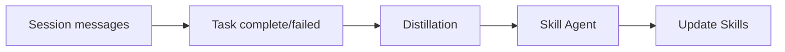
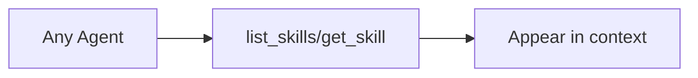

# Acontext

**收录日期:** 未知

**GitHub:** [https://github.com/memodb-io/Acontext](https://github.com/memodb-io/Acontext)
**Website:** [https://acontext.io/](https://acontext.io/)

## 简述

（README 表格中未提供简述，请参考下方 README 摘录）

## GitHub README 摘要

> |

## README 摘录（GitHub）

```markdown
<div align="center">
  <a href="https://discord.acontext.io">
      
  </a>
 	<p align="center">
 	  	<a href="https://acontext.io">🌐 Website</a>
      |
 	  	<a href="https://docs.acontext.io">📚 Document</a>
  </p>
  <p align="center">
    <a href="https://pypi.org/project/acontext/"></a>
    <a href="https://www.npmjs.com/package/@acontext/acontext"></a>
    <a href="https://github.com/memodb-io/acontext/actions/workflows/core-test.yaml"></a>
    <a href="https://github.com/memodb-io/acontext/actions/workflows/api-test.yaml"></a>
    <a href="https://github.com/memodb-io/acontext/actions/workflows/cli-test.yaml"></a>
  </p>
<p align="center">
 	  	<a href="https://x.com/acontext_io"></a>
    <a href="https://discord.acontext.io"></a>
  </p>
</div>


## What is Acontext?

Acontext is an open-source skill memory layer for AI agents. It **automatically** captures learnings from agent runs and stores them as **agent skill files** — files you can read, edit, and share across agents, LLMs, and frameworks.

If you want the agent you build to **learn from its mistakes** and **reuse what worked** — without opaque memory polluting your context — give Acontext a try.


## Skill is All You Need

Agent memory is getting increasingly complicated🤢 — hard to understand, hard to debug, and hard for users to inspect or correct. Acontext takes a different approach: if agent skills can represent every piece of knowledge an agent needs as simple files, so can the memory.

- **Acontext builds memory in the agent skills format**, so everyone can see and understand what the memory actually contains.
- **Skill is Memory, Memory is Skill**. Whether a skill comes from one you downloaded from Clawhub or one you created yourself, Acontext can follow it and evolve it over time.


## The Philosophy of Acontext

- **Plain file, any framework** — Skill memories are Markdown files. Use them with LangGraph, Claude, AI SDK, or anything that reads files. No embeddings, no API lock-in. Git, grep, and mount to the sandbox.
- **You design the structure** — Attach more skills to define the schema, naming, and file layout of the memory. For example: one file per contact, one per project by uploading a working context skill.
- **Progressive disclosure, not search** — The agent can use  `get_skill` and `get_skill_file` to fetch what it needs. Retrieval is by tool use and reasoning, not semantic top-k.
- **Download as ZIP, reuse anywhere** — Export skill files as ZIP. Run locally, in another agent, or with another LLM. No vendor lock-in; no re-embedding or migration step.

## How It Works

### Store — How skills get memorized?



- **Session messages** — Conversation (and optionally tool calls, artifacts) is the raw input. Tasks are extracted from the message stream automatically (or inferred from explicit outcome reporting).
- **Task complete or failed** — When a task is marked done or failed (e.g. by agent report or automatic detection), that outcome is the trigger for learning.
- **Distillation** — An LLM pass infers from the conversation and execution trace what worked, what failed, and user preferences.
- **Skill Agent** — Decides where to store (existing skill or new) and writes according to your `SKILL.md` schema.
- **Update Skills** — Skills are updated. You define the structure in `SKILL.md`; the system does extraction, routing, and writing.

### Recall — How the agent uses skills on the next run



Give your agent **Skill Content Tools** (`get_skill`, `get_skill_file`). The agent decides what it needs, calls the tools, and gets the skill content. No embedding search — **progressive disclosure, agent in the loop**.


# 🪜 Use It to Improve your Agent

Claude Code: 

```text
Read https://acontext.io/SKILL.md and follow the instructions to install and configure Acontext for Claude Code
```

OpenClaw:

```text
Read https://acontext.io/SKILL.md and follow the instructions to install and configure Acontext for OpenClaw
```


# 🚀 Step-by-step Quickstart

### Connect to Acontext

1. Go to [Acontext.io](https://acontext.io), claim your free credits.
2. Go through a one-click onboarding to get your API Key (starts with `sk-ac`)

<div align="center">
    <picture>
      
    </picture>
</div>


<details>
<summary>💻 Self-host Acontext</summary>

We have an `acontext-cli` to help you do a quick proof-of-concept. Download it first in your terminal:

```bash
curl -fsSL https://install.acontext.io | sh
```

You should have [docker](https://www.docker.com/get-started/) installed and an OpenAI API Key to start an Acontext backend on your computer:

```bash
mkdir acontext_server && cd acontext_server
acontext server up
```

> Make sure your LLM has the ability to [call tools](https://platform.openai.com

... (更多内容请访问上面 GitHub 链接)
```

